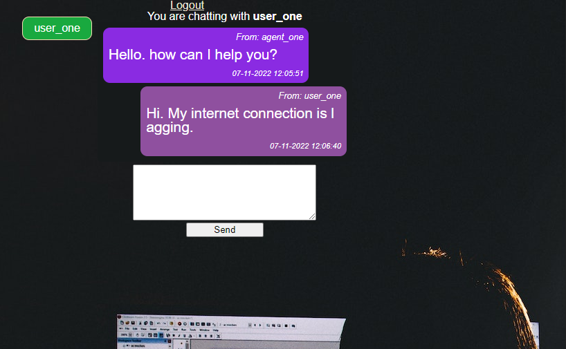

<h1 align="center">Olexiy Senichek  Full stack Javascript and Java developer</h1>
<h2>Passionate about programming, I've been doing it as a hobby for quite a while and now I'm pursuing it as a career. </h2>

 

# Skills

<h3>Languages:</h3>

<h3>Frameworks:</h3>

<!-- https://img.shields.io/badge/Express-000000?style=flat-square&logo=Express&logoColor=white -->

<h3>Backend:</h3>

<h3>UI:</h3>

<h3>Databases:</h3>

<h3>Tools:</h3>

### === I speak English, French, Ukrainian and Russian ===

 

# Projects

<h2 align=center>MusicO'll Meet</h2>

<a href="https://polite-digestion.surge.sh">https://polite-digestion.surge.sh</a>
 
 

<b>IMPORTANT:</b> disable AdBlock before testing the app.

It is a platform that aims to promote the organization of musical events, by facilitating the contact of musicians or groups (the Musicos) and the organizers (the MoMers). This app is a collaborative effort. I worked with 3 other students of the school <a href="https://oclock.io/formations/developpeur-web-fullstack-javascript">O'Clock</a>.

Here is how it works:

<ul>
    <li>The organizer creates an announcement;</li>
    <li>The musicians can apply (submit their candidature);</li>
    <li>The organizer can review the submission to accept or refuse  it;</li>
    <li>The organizer can finalize the announcement to turn it into an event after all of the submissions have been reviewed.</li>
</ul>

All the users have the possibility to update their profile information, upload pictures, filter the events and delete their profile. The authentication is done using JWT.

<b>Stack:</b> Node.js Express, Postgres, Cloudinary, React, Redux, Axios, HTML, CSS.

<b>Backend repository:</b> <a href="https://github.com/senichek/musico-ll-meet-back">https://github.com/senichek/musico-ll-meet-back</a>

<b>Frontend repository:</b> <a href="https://github.com/senichek/musico-ll-meet-front">https://github.com/senichek/musico-ll-meet-front</a>

 
 
<h2 align=center>Lessons Booking</h2>

<a href="https://obeisant-trees.surge.sh">https://obeisant-trees.surge.sh/</a>

 

The website is designed for students to book (reserve) the time slots for private lessons. The website supports only one teacher (one admin) with multiple students. The teacher (admin) can create (open) time slots and the users (students) can book them. The teacher can also add and modify the description of each time slot (lesson). The students can modify their profile information.

<b>Stack:</b> Java, Spring Boot, Hibernate, Data JPA, Postgres, Junit tests, React, Redux, HTML, CSS.

<b>Backend repository:</b> <a href="https://github.com/senichek/lesson-scheduler/tree/dev">https://github.com/senichek/lesson-scheduler/tree/dev</a>

<b>Frontend repository:</b> <a href="https://github.com/senichek/lesson-scheduler-front/tree/dev">https://github.com/senichek/lesson-scheduler-front/tree/dev</a>

<b>Swagger Docs:</b> <a href="https://lessons-booking.herokuapp.com/swagger-ui/index.html">https://lessons-booking.herokuapp.com/swagger-ui/index.html</a>

 
 
<h2 align=center>Shopping cart</h2>

<a href="https://shopping-cart-front-react.herokuapp.com/">https://shopping-cart-front-react.herokuapp.com</a>

 

The idea and layout of this app is taken from the <a href="https://angular.io/start">Angular's official guide</a> (it's not a typo). I've recreated
the app (with a couple of modifications) using React for my training purposes.
There are also tests using CYPRESS for frontend and JEST and SUPERTEST for backend.

<b>Stack:</b> Node.js Express, Mongo, React, HTML, CSS.

<b>Backend repository:</b> <a href="https://github.com/senichek/shopping-cart-rest-api-nodeJS-express">https://github.com/senichek/shopping-cart-rest-api-nodeJS-express</a>

<b>Frontend repository:</b> <a href="https://github.com/senichek/shopping-cart-react">https://github.com/senichek/shopping-cart-react</a>

 
 
<h2 align=center>Help Desk</h2>

<a href="https://lush-agreement.surge.sh">https://lush-agreement.surge.sh</a>

 

I did this project in order to experiment a bit with <b>Socket.IO</b>. This is a really basic chat app where users can register as "helpers" if they want to provide help to others (act as tech assistants or tech support) or as "user" if they'd like to get some help.
 

In order to test the app please follow these steps:
 
<ol style=1>
    <li>Open two instances of a browser;</li>
    <li>In the first instance of the browser log in as "user";</li>
    <li>In the second instance of the browser log in as helper and click the icon of a user you'd like to talk to.</li>
</ol>

<b>Stack:</b> Node.js Express, Postgres, Sequelize (ORM), React, Redux, HTML, CSS.

<b>Backend repository:</b> <a href="https://github.com/senichek/helpdesk-back">https://github.com/senichek/helpdesk-back</a>

<b>Frontend repository:</b> <a href="https://github.com/senichek/helpdesk-front">https://github.com/senichek/helpdesk-front</a>

<b>Chat Server repository:</b> <a href="https://github.com/senichek/helpdesk-chat-server">https://github.com/senichek/helpdesk-chat-server</a>

 
 
<h2 align=center>Pokedex (catalogue)</h2>

<a href="https://pokemons-catalogue.herokuapp.com">https://pokemons-catalogue.herokuapp.com</a>

 

One of the projects I did during my training at <a href="https://oclock.io/formations/developpeur-web-fullstack-javascript">"O'Clock"</a> school. This is a catalogue of pokemons that supports filtering.

<b>Stack:</b> Node.js Express, Postgres, Sequelize (ORM), EJS, HTML, CSS.

<b>Source code:</b> <a href="https://github.com/senichek/pokemon-catalogue-NodeJS-Express-PSQL">https://github.com/senichek/pokemon-catalogue-NodeJS-Express-PSQL</a>

 
 
<h2 align=center>To-do list</h2>

<a href="https://to-do-list-olexiy.herokuapp.com">https://to-do-list-olexiy.herokuapp.com</a>

 

Also one of the projects I did during my training at <a href="https://oclock.io/formations/developpeur-web-fullstack-javascript">"O'Clock"</a> school. This is a basic to-do list done using Vanilla JS.

<b>Stack:</b> Node JS, Express, Postgres, CSS, HTML, Sequilize, EJS, Fetch API.

<b>Source code:</b> <a href="https://github.com/senichek/oTodo-list">https://github.com/senichek/oTodo-list</a>

 
 
<h2 align=center>Calories tracking app (Java)</h2>

<a href="https://olexiy-calories-tracking.herokuapp.com">http://olexiy-calories-tracking.herokuapp.com</a>

 

This is the project I did with other students during the internship at <a href="https://javaops.ru/">https://javaops.ru</a>
  The aim of the application is to track the calories of each meal of the day. If the limit of the calories is exceeded, the entries get marked by red.

<b>Stack:</b> Spring Security, Spring MVC, Spring Data JPA, Spring Security Test, Hibernate ORM, Hibernate Validator, SLF4J, Json Jackson, JSP, DataTables plugin, PostgreSQL, JUnit, Bootstrap.

<b>Source code:</b> <a href="https://github.com/senichek/topjava">https://github.com/senichek/topjava</a>

 
 
<h2 align=center>Lunch place picker (Java)</h2>

<a href="https://lunch-place-picker.herokuapp.com">https://lunch-place-picker.herokuapp.com</a>

 

I completed this project solo but the idea and the description of the project was provided by the mentor at <a href="https://javaops.ru/">https://javaops.ru</a>

Java project with registration/authorization and role-based access (USER, ADMIN). Services and Controllers are covered by tests. Please, use Google Chrome or Mozilla Firefox.
This is a voting system for deciding where to have lunch. 2 types of users: admin and regular users. Admin can input a restaurant and it's lunch menu of the day. Menu changes each day (admins do the updates). Users can vote at which restaurant they want to have lunch. Only one vote counted per user (one unique vote per user). 
If a user votes again the same day:

- if it is before 11:00 A.M. we assume that a user changed his mind;

- if it is after 11:00 A.M. then it is too late, vote can't be changed;

<b>Stack:</b> Spring Security, Spring MVC, Spring Data JPA, Spring Security Test, Hibernate ORM, Hibernate Validator, SLF4J, Json Jackson, JSP, DataTables plugin, PostgreSQL, JUnit, Bootstrap.

<b>Source code:</b> <a href="https://github.com/senichek/lunchplacepicker">https://github.com/senichek/lunchplacepicker</a>

 
 
<h2 align=center>Pay my buddy (Java)</h2>

<a href="https://money-transfer.herokuapp.com">https://money-transfer.herokuapp.com</a>

 

One of the projects I did during my training at Openclassrooms. The description of the course: <a href="https://openclassrooms.com/fr/paths/191-developpeur-dapplication-java">https://openclassrooms.com/fr/paths/191-developpeur-dapplication-java</a>
  The application allows adding people to the friend's list (connections) and transferring the money between the friends from the list. You can also recharge your account by adding the money.

<b>Stack:</b> Spring Boot, Spring Security, Spring Data JPA, Hibernate, PostgreSQL, JUnit, Bootstrap.

<b>Source code:</b> <a href="https://github.com/senichek/paymybuddy">https://github.com/senichek/paymybuddy</a>

